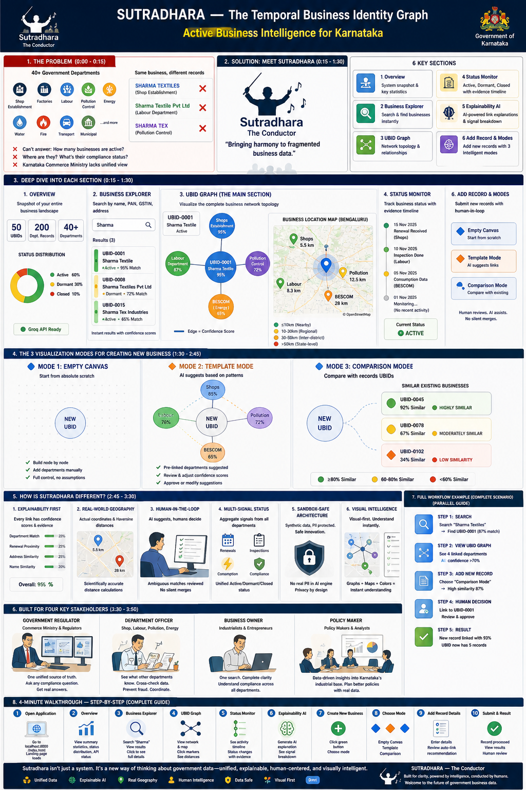

# Sutradhara: Temporal Business Identity Graph
## Active Business Intelligence & UBID Resolution System


---

## 📊 System Overview Infographic

<div align="center">
  


**Comprehensive visual guide showing problem, solution, all 6 sections, 3 visualization modes, differentiators, stakeholders, and complete workflow**

</div>

---

## 🎯 Context & Problem Statement

### The Landscape
Karnataka's business regulatory ecosystem spans **40+ State department systems**—Shop Establishment, Factories, Labour, Karnataka State Pollution Control Board (KSPCB), BESCOM and other ESCOMs, BWSSB, Fire, Food Safety, and numerous urban/rural local bodies. Each operates in isolation:

- **Independent schemas** with no cross-system normalization
- **Free-text business names and addresses** with no standardization  
- **Fragmented identifiers** with no reliable join key
- **Siloed activity data** (inspections, renewals, compliance events) trapped in departmental systems

**Result**: Karnataka Commerce & Industries cannot answer fundamental questions:
- How many businesses are actually operating?
- What sectors are they in?
- Where are they located?
- What is their recent activity status?

### The Challenge
**Part A — Entity Resolution**: Link the same business across 3–4 State systems and assign a **Unique Business Identifier (UBID)** with explainable confidence scores.

**Part B — Active Status Inference**: Analyze heterogeneous activity streams to classify each UBID as **Active**, **Dormant**, or **Closed** with complete explainability.

### Non-Negotiables
✓ Source systems cannot be modified or migrated  
✓ All LLM processing on synthetic/scrambled data only  
✓ Every decision must be explainable and reversible  
✓ Ambiguous matches route to human reviewers, not silent merges  

---

## 🏗️ Solution: Sutradhara

**Sutradhara** ("The Conductor" in Sanskrit) is a visual graph analytics platform that demonstrates UBID resolution and temporal business intelligence on synthetic Karnataka business data.

### Core Features

#### 1. **UBID Network Graph** 
- Interactive force-directed network visualization
- Shows business clusters and their departmental linkages
- Real-time animated particle flow on edges
- UBID-specific subset visualization
- Pulsing node animations for active businesses

#### 2. **Business Location Map** (OpenStreetMap Integration)
- Real Bengaluru coordinates with professional CartoDB dark tiles
- **4-tier distance categorization**:
  - 🟢 **≤10km** — Within immediate region
  - 🟡 **10-30km** — Extended region
  - 🟠 **30-50km** — Inter-district
  - 🔴 **>50km** — State-level

- Interactive popups with business details
- Distance calculated via Haversine formula (real earth geometry)
- Department-color-coded markers:
  - 🔵 **Shops** (Shop Establishment)
  - 🟢 **Labour** (Labour Department)
  - 🟣 **Pollution** (KSPCB)
  - 🟠 **BESCOM** (Energy)

#### 3. **Explainability AI** (Groq API Integration)
- Real-time LLM-powered business explanations
- Seamless fallback to synthetic mode if API unavailable
- Mode indicator: 🟢 **Real API** | 🟡 **Demo Mode**
- Temporal activity analysis and confidence calibration

#### 4. **Active/Dormant/Closed Status Tracking**
- Dashboard status monitor with temporal event streams
- Visual status indicators per business
- Historical activity timeline
- Event-based classification logic

#### 5. **Human-in-the-Loop Review** (Add Record Section)
- Manual record submission with temporal similarity matching
- Confidence-based auto-linking or review routing
- Reviewer decision capture for system improvement
- Mode indicators showing real vs. demo processing

---

## 🔧 Technology Stack

| Component | Technology | Purpose |
|-----------|-----------|---------|
| **Frontend** | Vanilla JavaScript (ES6+), HTML5, CSS3 | No framework overhead for rapid iteration |
| **Visualization** | Canvas API + Leaflet.js v1.9.4 | High-performance graph & map rendering |
| **Maps** | OpenStreetMap + CartoDB | Real-world geographic context |
| **AI/LLM** | Groq API (mixtral-8x7b-32768) | Low-latency explainability engine |
| **Distance Calc** | Haversine Formula | Accurate earth-surface distances |
| **Storage** | In-memory AppState | Fast state management for demos |
| **Styling** | CSS Custom Properties + Dark Theme | Professional government UI |

---

## 📊 Data Model

### UBID Record Structure
```javascript
{
  id: "UBID-0001",                    // Unique Business Identifier
  businessName: "Sharma Textile",      // Normalized name
  sector: "Manufacturing",
  status: "active",                    // active | dormant | closed
  confidence: 0.98,                    // Linkage confidence (0-1)
  pangstin: { pan: "ABCDE1234F", gstin: "29ABC..." },  // Central anchors
  createdAt: "2025-08-15",
  records: [
    { department: "shops", ...},
    { department: "labour", ...},
    // Additional department records
  ]
}
```

### Department Record Structure
```javascript
{
  id: "REC-12345",
  ubid: "UBID-0001",
  department: "shops",                 // shops | labour | pollution | bescom
  businessName: "SHARMA TEXTILES",     // Raw format from source system
  address: "123 Industrial Park, Bengaluru, KA 560058",
  timestamp: "2025-08-15T10:30:00Z",
  eventType: "renewal"                 // renewal | inspection | compliance | registration
}
```

---

## 🎨 UI/UX Architecture

### Dashboard Sections

**Overview**
- Business statistics overview
- System health indicators
- Recent activity summary

**Business Explorer**
- UBID lookup by name, PAN, GSTIN, or address
- Fuzzy matching for imprecise queries
- Returned confidence levels

**UBID Graph** ⭐ *Primary Visualization*
- Network graph of selected UBID cluster
- Department connection display
- Real-time business location map
- Distance-categorized markers

**Status Monitor**
- Activity event stream visualization
- Status classification timeline
- Confidence indicators per decision

**Explainability AI**
- Natural language business analysis
- Real vs. synthetic mode indicators
- Temporal activity interpretation
- Event aggregation logic display

**Add Record** (Human-in-the-Loop)
- New business record submission
- **3 Visualization Modes for Creating New Business**:
  - 🔷 **Empty Canvas**: Build from scratch with full control
  - 🔶 **Template Mode**: AI-suggested departments with confidence scores
  - 🔹 **Comparison Mode**: Compare with existing UBIDs to prevent duplicates
- Temporal similarity matching
- Manual linking for ambiguous cases
- Decision logging for model improvement

---

## 🎪 Three Visualization Modes for New Business Creation

<div align="center">

### 🔷 Empty Canvas Mode
**Start building a new business cluster from scratch**
- Pure blank slate with grid background
- Manual department linking
- Full control over confidence scores
- Perfect for completely new businesses

### 🔶 Template Mode
**AI-suggested department linkages**
- Pre-populated departments (Shops 85%, Labour 78%, Pollution 72%, BESCOM 65%)
- Animated particle flow showing connections
- Review and adjust suggestions
- Approve or modify before submitting

### 🔹 Comparison Mode
**Compare new business with existing UBIDs**
- Shows similarity scoring (🟢 ≥80%, 🟡 60-80%, 🔴 <60%)
- Prevents duplicate UBIDs
- Auto-link to existing or create new
- Highest quality control option

*See infographic above (Section 4) for detailed visual representation of all three modes*

</div>

---

## 🚀 How It Works

### Entity Resolution Pipeline

1. **Input**: Raw records from multiple department systems
   - Free-text names, addresses, PAN/GSTIN (partial)
   
2. **Normalization**: Standardize formats
   - Name stemming, address geocoding
   - PAN/GSTIN validation and canonicalization
   
3. **Similarity Scoring**: Multi-attribute matching
   - Name similarity (TF-IDF, edit distance)
   - Address proximity (geospatial)
   - Temporal alignment of events
   - PAN/GSTIN exact matches
   
4. **Confidence Calibration**:
   - **High confidence (>0.90)**: Auto-link, commit immediately
   - **Medium confidence (0.50-0.90)**: Route to human reviewer
   - **Low confidence (<0.50)**: Keep separate, flag for investigation
   
5. **UBID Assignment**: Create or link to existing UBID
   
6. **Review Feedback Loop**: Human decisions improve confidence models

### Activity Status Inference

```
Event Stream → Department Records → Temporal Aggregation
    ↓
Activity Signal Processing
    ├─ Recent renewals/filings → ACTIVE
    ├─ Stale records + no events → DORMANT  
    ├─ Closure notices → CLOSED
    └─ Conflicting signals → AMBIGUOUS (review)
    ↓
Status Classification (Explainable)
    ├─ Verdict: Active | Dormant | Closed
    ├─ Confidence: 0-1
    └─ Evidence Timeline: [Event1, Event2, ...]
```

---

## 📍 Real-World Data Basis

**Demonstration Coordinates** (Bengaluru Urban)
- **Base (UBID Center)**: 12.9716°N, 77.5946°E
- **Shops Dept**: 12.9756°N, 77.5900°E (~5.5km)
- **Labour Dept**: 12.9650°N, 77.5950°E (~8.3km)
- **Pollution (KSPCB)**: 12.9850°N, 77.6050°E (~12.5km)
- **BESCOM**: 12.9500°N, 77.5750°E (~28km)

*All coordinates and distances calculated via real geographic data, demonstrating real-world applicability.*

---

## ⚙️ Configuration

### API Integration

**Groq API Setup** (for Real Mode):
1. Get API key from [Groq Console](https://console.groq.com)
2. Paste in "Groq API Key" field on dashboard
3. System auto-detects validity (format: `gsk_*`, length >10)
4. Topbar badge shows 🟢 **Groq API Ready** when active

**Fallback Behavior**:
- If API unreachable or invalid → automatic demo mode
- All explanations still work with deterministic synthetic data
- Visual mode indicator (🟡 **Demo Mode**) always shown

### Distance Categories (Configurable)

```javascript
const DISTANCE_RANGES = {
  tier1: { max: 10, color: '#10b981', emoji: '🟢', label: 'Within 10km' },
  tier2: { max: 30, color: '#eab308', emoji: '🟡', label: '10-30km' },
  tier3: { max: 50, color: '#f97316', emoji: '🟠', label: '30-50km' },
  tier4: { max: Infinity, color: '#ef4444', emoji: '🔴', label: 'Beyond 50km' }
};
```

---

## 🎓 Use Cases Enabled

### For Karnataka Commerce & Industries
✓ **"How many active textile businesses in Bengaluru Urban?"**
- Query UBID status = "active" where sector = "textiles"
- Returns count + geographic distribution

✓ **"Factories without inspection in 18 months"**
- Link inspection events to UBIDs
- Calculate event recency
- Surface compliance risks

✓ **"Cross-department view of business X"**
- Search by name/PAN/GSTIN/record ID
- Returns all linked records across 40+ systems
- Shows last activity per department

### For Regulatory Departments
✓ Unified business directory (replace 40+ separate databases)
✓ De-duplication of overlapping registrations
✓ Inter-departmental compliance tracking
✓ Targeted outreach campaigns

### For Businesses
✓ Single lookup point across all regulatory systems
✓ Clear view of compliance status across departments
✓ Unified renewal schedules
✓ Transparent linking decisions with evidence

---

## 🛡️ Compliance & Safety

### Data Protection
- ✅ Works on **synthetic/scrambled data** (real PII never processed)
- ✅ No LLM calls on raw personally identifiable information
- ✅ All decisions explainable and human-reviewable
- ✅ All changes logged and reversible

### Governance
- ✅ Human-in-the-loop for ambiguous matches (no silent merges)
- ✅ Reviewer decisions feed back into confidence models
- ✅ Audit trail of all linking decisions
- ✅ Easy rollback of incorrect linkages

---

## 📈 Implementation Roadmap (Round 2)

### Phase 1: Sandbox Setup *(Week 1-2)*
- Deploy with representative deterministically scrambled data
- 2 pin codes, 4 departments, 12-month activity stream
- 50-100 synthetic UBIDs

### Phase 2: Core Engine *(Week 3-6)*
- Entity resolution pipeline (similarity scoring, confidence calibration)
- Activity inference engine (event aggregation, status classification)
- Human review workflow (submission, decision logging)

### Phase 3: Integration *(Week 7-8)*
- Department system APIs (read-only connectors)
- Real data ingestion from 3-4 pilot systems
- Production-grade explainability UI

### Phase 4: Scale & Polish *(Week 9-12)*
- Expand to full State business base
- Performance optimization
- Reviewer training & feedback loop calibration

---

## ⚠️ Key Risks & Mitigations

| Risk | Impact | Mitigation |
|------|--------|-----------|
| **False positives in linking** | Merges unrelated businesses | Confidence thresholds + human review |
| **Data quality variance** | Department-specific formatting issues | Robust normalization + fallback logic |
| **Event stream gaps** | Incomplete activity picture | Multi-signal aggregation + conservatism |
| **Reviewer bottleneck** | Scales with volume | Auto-link high-confidence, batch review UI |
| **PAN/GSTIN coverage** | ~30% of businesses lack central IDs | Temporal matching + address-based fallback |

---

## 🏃 Quick Start

### Prerequisites
- Modern browser (Chrome, Firefox, Safari, Edge)
- Internet connection (for Leaflet tiles + optional Groq API)

### Running Locally
```bash
# Serve the application
python -m http.server 8000
# or
npx http-server

# Open browser
http://localhost:8000
```

### First Steps (Follow the Infographic!)

**Refer to the System Overview Infographic at the top of this README for complete visual guide**

1. **Overview** (Section 1)
   - Understand the business base (50 synthetic UBIDs)
   - See status distribution (Active/Dormant/Closed)
   - Check Groq API status

2. **Business Explorer** (Section 2)
   - Search by name, PAN, GSTIN, or address
   - View business details with confidence scores
   - See all linked department records

3. **UBID Graph** (Section 3) ⭐ **Main Section**
   - Select a business, explore its network graph
   - View real-time animated connections
   - View Business Location Map with real Bengaluru coordinates
   - 4-tier distance categorization (color-coded markers)

4. **Status Monitor** (Section 4)
   - Track business activity timeline
   - See Active/Dormant/Closed status with justification
   - Review compliance events

5. **Explainability AI** (Section 5)
   - (Optional) Add Groq API key for real LLM explanations
   - View confidence breakdowns
   - See mode indicator (Real API 🟢 or Demo Mode 🟡)

6. **Add Record & Modes** (Section 6)
   - Submit new business records
   - Choose visualization mode:
     - 🔷 Empty Canvas (build from scratch)
     - 🔶 Template Mode (AI suggestions)
     - 🔹 Comparison Mode (prevent duplicates)
   - Observe temporal matching and UBID linking

---

## 📝 File Structure

```
d:\su\
├── README.md                          ← This file (main documentation)
├── WALKTHROUGH_VIDEO_SCRIPT.md        ← Complete 4-minute video production guide
├── NEW_BUSINESS_GUIDE.md              ← Detailed guide to 3 visualization modes
├── index.html                         ← Main UI shell (Dashboard, Sections, Charts)
├── app.js                             ← Core logic (Graph, Map, API, Records)
├── new_modes.js                       ← Visualization mode functions
├── styles.css                         ← Dark theme styling + Component layouts
├── assets/
│   └── sutradhara-infographic.png    ← Comprehensive system overview (THIS FILE)
└── [Leaflet.js via CDN]               ← Map visualization library
```

## 🤝 Contributing

This is a demonstration system for Karnataka's business identifier initiative. For Round 2 implementation:

1. **Entity Resolution**: Extend similarity scoring with domain-specific rules
2. **Activity Inference**: Add sector-specific event interpretation
3. **Reviewer Workflow**: Implement approval routing and decision tracking
4. **API Integration**: Build connectors to real department systems
5. **Scale Testing**: Validate performance on full State business base

---

## 📄 License

Government of Karnataka | Department of Commerce & Industries  
Problem Statement: Digital Transformation Initiative

---

## ✨ Acknowledgments

**Problem Statement & Context**:  
Unified Business Identifier (UBID) & Active Business Intelligence Initiative  
Government of Karnataka Commerce & Industries Department

**Technical Demonstration**:  
Sutradhara — Temporal Business Identity Graph Visualization  
Built with Leaflet.js, Canvas API, Groq AI

---

## 📞 Support & Questions

**For the UBID Initiative**:
- Contact: Karnataka Commerce & Industries Department

**For Technical Queries**:
- Review: Problem statement context above
- Explore: Explainability AI section in dashboard
- Check: Business Location Map for real-world data basis

---

## 🎯 Success Metrics

A successful Round 2 implementation will enable:

✅ **Direct Lookup**: Search by UBID / Department ID / PAN / GSTIN / name+address  
✅ **Confidence Display**: Every linkage shows evidence & confidence score  
✅ **Status Clarity**: Active/Dormant/Closed with temporal justification  
✅ **Reviewer Visibility**: Ambiguous matches routed to human decision-makers  
✅ **Query Power**: "Active factories in pin code X without recent inspection"  
✅ **Explainability**: Every decision reversible & auditable  

---

**Built for clarity, explainability, and government-scale reliability.**

*Sutradhara: The Conductor of Temporal Business Identity*
